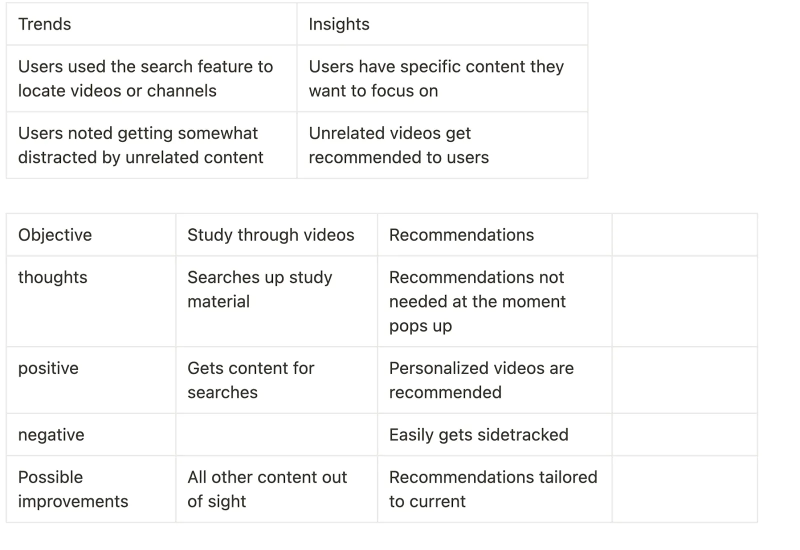
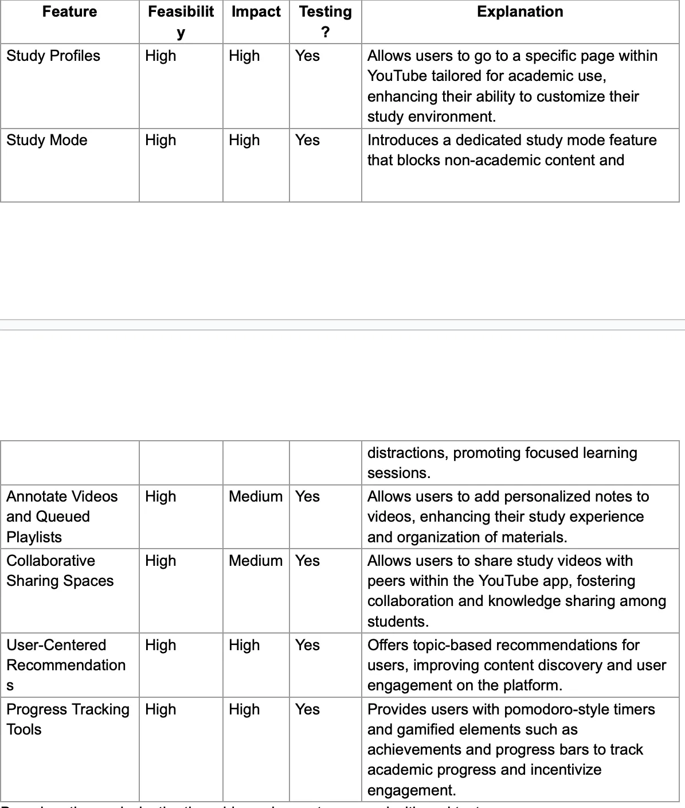

# YouTube as a Study Tool: Overcoming Distractions for Focused Learning

In the vast digital playground of YouTube, distraction is just a click away. While the platform offers a treasure trove of educational content, the very features that make it engaging also make it challenging to use for focused study. This article explores the problem of distraction on YouTube and presents a concept for a new feature that aims to make the platform a more effective tool for learning.

Picture this: You embark on a study session, seeking a tutorial to bolster your understanding. Yet, amidst the sea of recommendations, your attention veers off course. Before you know it, you’re entranced by an ASMR clip, and your scholarly endeavors are abruptly halted.

The crux of the issue lies in the dual challenge of resisting the siren call of captivating recommendations and maintaining focus on academic pursuits. Through extensive user research, I delved into the psyche of fellow students, uncovering the insidious grip of YouTube’s algorithm and the dire need for a tool to safeguard against distractions.

## The People Problem

While trying to study, it’s easy to get sidetracked by the myriad of enticing recommendations that YouTube’s algorithm serves up.  
The core of the problem is twofold:
- Difficulty in controlling usage due to highly engaging recommended content.
- The ease of getting distracted by videos unrelated to the academic task at hand.

## Understanding Distraction: Insights from User Research

In my quest to understand why students often find themselves easily distracted on YouTube, I embarked on a user search. Through this journey, I uncovered a significant revelation: the algorithm’s remarkable proficiency in recommending highly engaging content poses a considerable challenge for users striving to adhere to their educational objectives. Additionally, I discovered a crucial aspect: users must actively select the content they wish to engage with. This realization underscored the pressing need for a feature dedicated to assisting users in maintaining their focus during study sessions.

As I delved deeper into my research, I meticulously documented the trends I observed, coupling them with illuminating insights. Subsequently, in a thorough analysis, I carefully scrutinized both the positive and negative aspects of each user objective. Furthermore, I proposed potential enhancements aimed at alleviating distractions and improving the overall user experience.

## Brainstorming and Analyzing Solutions

In response to this pressing need, I collaborated with peers and mentors to brainstorm potential solutions. Together, we explored various ideas and carefully evaluated them based on their feasibility, impact, and potential for user testing. Here are some of the solutions we considered:

- **Study Profiles**: These are personalized pages within YouTube designed specifically for academic use. Users can customize their study profiles, access settings, and set specific learning goals to tailor their educational experience.
- **Study Mode**: This feature acts as a shield against distractions by blocking non-academic content. By activating Study Mode, users can create a focused learning environment conducive to their educational endeavors.
- **Annotate Videos and Queued Playlists**: This feature enhances organization by allowing users to add personal notes to videos and create queued playlists. By annotating videos, users can highlight key points or jot down important information for future reference.

After thorough analysis, we concluded that **Study Mode** held the most promise for further development. Its straightforward approach directly addresses the distraction problem, making it an ideal candidate for further exploration and refinement.

## Designing the Study Mode

**Study Mode** is designed to offer a distraction-free YouTube experience. Key components of the feature include:

- **Content Filtering Mechanism**: Distinguishes between academic and non-academic content.
- **Study Mode Button**: Allows users to toggle the distraction-free mode on and off.
- **Customizable Settings**: Users can specify subjects or topics of interest to further personalize the experience.

The development process included creating low-fidelity sketches to visualize these concepts, followed by the creation of an information hierarchy diagram to illustrate how the feature integrates with the existing YouTube interface.

This information hierarchy figure represents how the user will access my feature from the greater YouTube app and possible explorations of where the user can go and do.

## Implementation and Testing

After designing the interface, I moved on to the interactive design phase, creating medium-fidelity prototypes using existing UI kits. These prototypes were then tested with users to gather feedback and refine the design. The final design focuses on the core functionality of the **Study Mode**, providing a clear and concise user experience that emphasizes academic content.

### Medium-Fidelity Prototypes

My medium fidelities contain explorations of the feature from different entry points to the end.

### High-Fidelity Prototypes

I selected the third flow as the final iteration because it emphasizes the core functionality of **Study Mode** — accessing and watching academic videos. Unlike the other flows focused on customization and settings, this flow showcases the primary feature, enhancing user engagement and comprehension within a concise and straightforward experience.

## Conclusion: A Step Toward Focused Learning

Incorporating a feature like **Study Mode** into YouTube could significantly enhance the platform’s utility as an educational tool. By allowing students to control their viewing environment, YouTube can transform from a source of distraction into a focused learning aid. This case study not only highlights the design process but also underscores the importance of user-centered design in creating features that address specific user needs.
